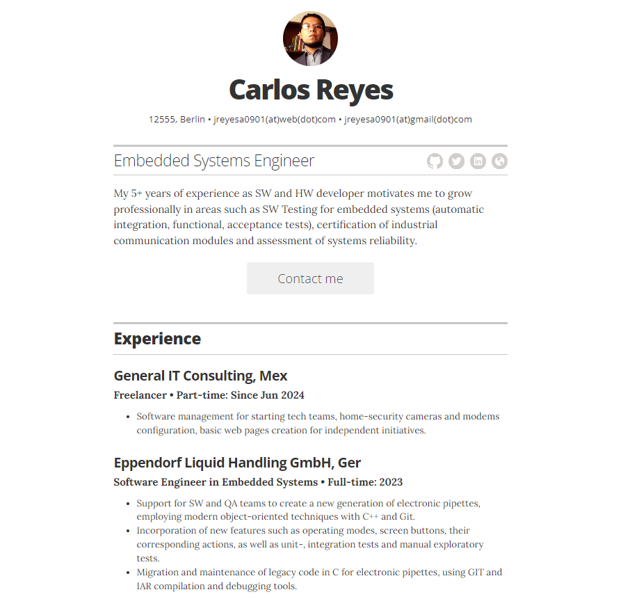

# Resume template

*A simple Jekyll + GitHub Pages powered resume.*

## Disclaimer 
This Github page was made reworking [jglovier](https://github.com/jglovier/)'s version as an example following official GitHub's and Jekyll's documentation. The mentioned examples and this repo can be used under [Fair Use](https://en.wikipedia.org/wiki/Fair_use) for educational purposes. Project license does not apply to use of this material.

Mind the following articles:

- [Prohibited uses](https://docs.github.com/en/pages/getting-started-with-github-pages/about-github-pages#prohibited-uses)
- [Educational excercises](https://docs.github.com/en/pages/getting-started-with-github-pages/about-github-pages#educational-exercises)
- [Usage limits](https://docs.github.com/en/pages/getting-started-with-github-pages/about-github-pages#usage-limits)

## License

The code and styles are licensed under the MIT license. [See project license.](LICENSE) As stated in the original repo, obviously you should not use the content of this demo repo in your own resume. :wink:

